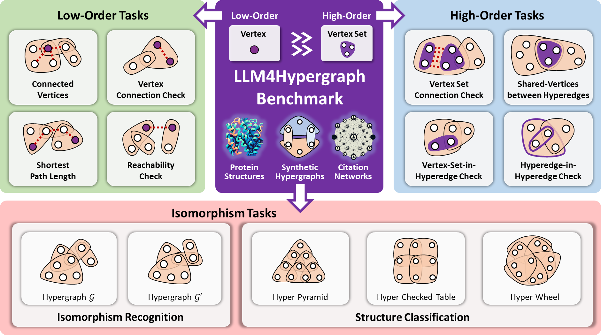
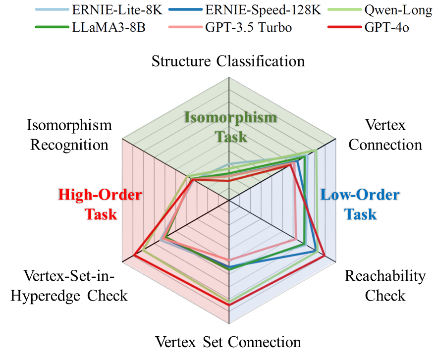

# LLM4Hypergraph
This repository contains the source for the paper "Beyond Graphs: Can Large Language Models Comprehend Hypergraphs?" published in xxx by xxx, xxx, xxx. This paper is avaiable at [here]().


## Introduction
In this repository, we provide the code for generating hypergraphs and tasks for the experiments in the paper. We also provide the code for evaluating the performance of LLMs like ERNIE-Lite-8K, ERNIE-Speed-128K, Qwen-Long, LLaMA3-8B, GPT-3.5-Turbo, and GPT-4o on hypergraph tasks. 

<center>
  
</center>

We intoduce the following three types of tasks:

**Isomorphism Tasks**: 
- *Isomorphism Recognition.* This task assesses the model’s ability to determine whether two hypergraph representations correspond to the same underlying structure.
- *Structure Classification.* This task evaluates the model’s proficiency in distinguishing hypergraphs based on their macro-level architectural frameworks.

**Low-Order Tasks**:
- *Hyperedge Count.* Counts the total number of hyperedges.
- *Vertex Count.* Counts the total number of vertices.
- *Vertex Degree.* Counts the hyperedges connected to a specific vertex.
- *Vertex Connection.* Checks if two vertices are directly connected by a hyperedge.
- *Connected Vertices.* Lists all vertices connected to a given vertex.
- *Disconnected Vertices.* Lists all vertices not connected to a given vertex.
- *Shortest Path.* Finds the shortest path between two vertices.
- *Reachability Check.* Determines if one vertex can be reached from another.

**High-Order Tasks**:
- Hyperedge Degree. Determines the number of vertices in a given hyperedge.
- Vertex Set Connection (VS Connection). Checks if two vertex sets are jointly contained within at least one hyperedge.
- Vertex-Set-in-Hyperedge Check (VS-in-He Check). Determines if a set of vertices is entirely contained within any hyperedge.
- Hyperedge-in-Hyperedge Check (He-in-He Check). Assesses if one hyperedge is completely contained within another hyperedge.
- Shared-Vertices between Hyperedges. Identifies and outputs the set of vertices shared between two hyperedges.

We also intoduce seven hypergraph languages for hypergraph description, including:

**Low-Order Structure Languages:**
- *Low-Order-Incidence Description (LO-Inc):* Describes pairwise connections between vertices, e.g., ''Vertex $v_1$ is connected to vertices $v_2$ and $v_3$.''
- *Neighbor-Pair Description (N-Pair):* Lists all pairs of vertices that share a hyperedge, e.g., ''$(v_1, v_2), (v_1, v_3)$.''
- *Raw Adjacency Matrix Description (Adj-Mat):* Uses a numerical adjacency matrix where binary values indicate connections between vertex pairs.

**High-Order Structure Languages:**
- High-Order Neighbor Description (HO-Neigh): Describes hypergraph relationships in two stages, detailing connections between vertices and hyperedges, then hyperedges and their vertices.
- High-Order Incidence Description (HO-Inc): Extends LO-Inc by including higher-order correlations, such as ''Vertex $v_1$ is connected to vertices $v_2$ and $v_3$ with hyperedge $e_1$.''
- Neighbor-Set Description (N-Set): Lists entire sets of vertices connected by each hyperedge, for example, ''$(v_1, v_2, v_3)$.''
- Raw Incidence Matrix Description (Inc-Mat): Uses an incidence matrix where each entry indicates the inclusion of a vertex in a hyperedge.

## Environments
* [python 3.9](https://www.python.org/): basic programming language.
* [dhg 0.9.4](https://github.com/iMoonLab/DeepHypergraph): for hypergraph representation and learning. 
* [torch 1.12.1](https://pytorch.org/): for computation.
* [networkx](https://networkx.org/): for graph representation and computation.
* [numpy](https://numpy.org/): for computation.
* [absl-py](https://abseil.io/): for computation.

## Installation
Clone this repository.
Install the required libraries.

```sh
pip install -r requirements.txt
```

## Usage

### Generating hypergraphs

```sh
./hypergraph_generator.sh
```

### Generating files for tasks

```sh
./task_generator.sh
```

### Evaluating LLMs

```sh
python ./eval_LLM.py
```


## Citation
xxx


