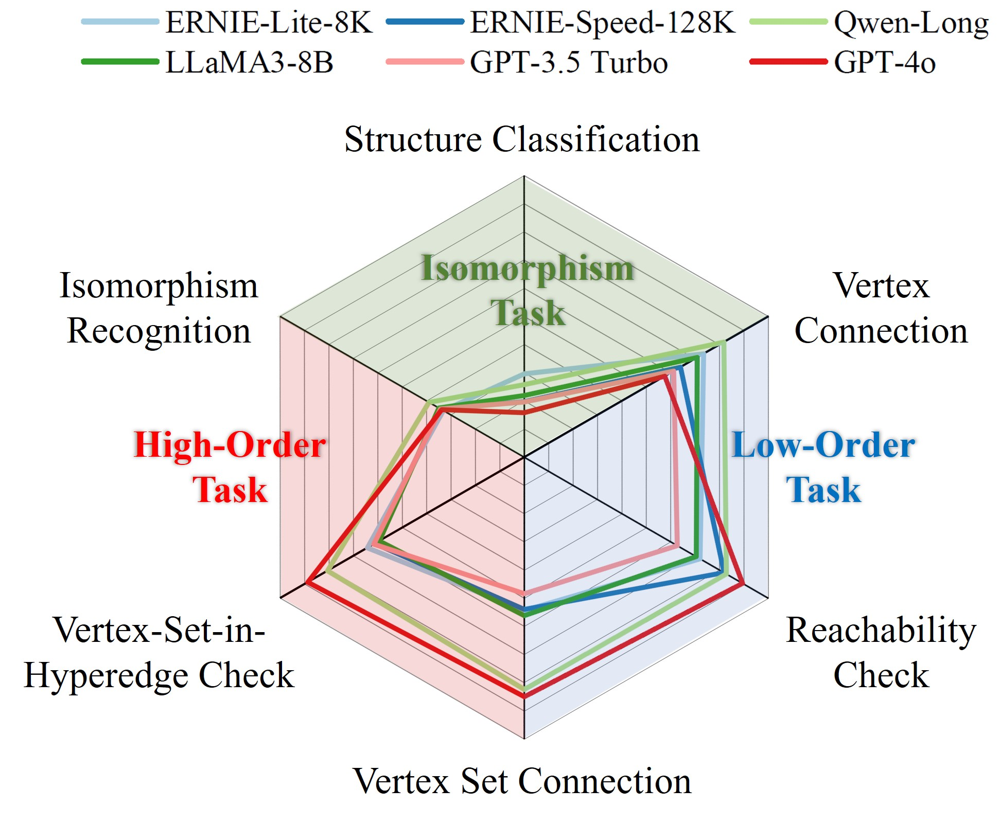

# LLM4Hypergraph
This repository contains the source for the paper "Beyond Graphs: Can Large Language Models Comprehend Hypergraphs?". This paper is avaiable at [here](https://arxiv.org/abs/2410.10083).


## Introduction
In this repository, we provide the code for generating hypergraphs and tasks for the experiments in the paper. We also provide the code for evaluating the performance of LLMs like ERNIE-Lite-8K, ERNIE-Speed-128K, Qwen-Long, LLaMA3-8B, GPT-3.5-Turbo, and GPT-4o on hypergraph tasks. 


<div align="center" id="cmp"> 
  

  &#xa0;

</div>

We intoduce the following three types of tasks:

**Isomorphism Tasks**: 
- *Isomorphism Recognition.* This task assesses the model’s ability to determine whether two hypergraph representations correspond to the same underlying structure.
- *Structure Classification.* This task evaluates the model’s proficiency in distinguishing hypergraphs based on their macro-level architectural frameworks.

**Low-Order Tasks**:
- *Hyperedge Count.* Counts the total number of hyperedges.
- *Vertex Count.* Counts the total number of vertices.
- *Vertex Degree.* Counts the hyperedges connected to a specific vertex.
- *Vertex Connection.* Checks if two vertices are directly connected by a hyperedge.
- *Connected Vertices.* Lists all vertices connected to a given vertex.
- *Disconnected Vertices.* Lists all vertices not connected to a given vertex.
- *Shortest Path.* Finds the shortest path between two vertices.
- *Reachability Check.* Determines if one vertex can be reached from another.

**High-Order Tasks**:
- Hyperedge Degree. Determines the number of vertices in a given hyperedge.
- Vertex Set Connection (VS Connection). Checks if two vertex sets are jointly contained within at least one hyperedge.
- Vertex-Set-in-Hyperedge Check (VS-in-He Check). Determines if a set of vertices is entirely contained within any hyperedge.
- Hyperedge-in-Hyperedge Check (He-in-He Check). Assesses if one hyperedge is completely contained within another hyperedge.
- Shared-Vertices between Hyperedges. Identifies and outputs the set of vertices shared between two hyperedges.

We also intoduce seven hypergraph languages for hypergraph description, including:

**Low-Order Structure Languages:**
- *Low-Order-Incidence Description (LO-Inc):* Describes pairwise connections between vertices, e.g., ''Vertex $v_1$ is connected to vertices $v_2$ and $v_3$.''
Example:
```plaintext
Prompt: G describes a hypergraph among vertices v0, v1, v2, v3, v4, and v5 and hyperedges e0, e1, e2, and e3.
  In this hypergraph:
  Vertex v0 is connected to vertices v1, v2, v3, v4, v5.
  Vertex v1 is connected to vertices v0, v2, v3, v4, v5.
  Vertex v2 is connected to vertices v0, v1, v3, v4, v5.
  Vertex v3 is connected to vertices v0, v1, v2, v4, v5.
  Vertex v4 is connected to vertices v0, v1, v2, v3, v5.
  Vertex v5 is connected to vertices v0, v1, v2, v3, v4.*
```
- *Neighbor-Pair Description (N-Pair):* Lists all pairs of vertices that share a hyperedge, e.g., ''$(v_1, v_2), (v_1, v_3)$.''
Example:
```plaintext
Prompt: In an undirected hypergraph, (i,j) means that vertex i and vertex j are connected with an undirected hyperedge. G describes a hypergraph among vertices v0, v1, v2, v3, v4, and v5 and hyperedges e0, e1, e2, and e3.
  The connection relation between vertices in G are: (v0, v1) (v2, v4) (v1, v2) (v0, v4) (v3, v4) (v1, v5) (v0, v3) (v1, v4) (v2, v3) (v0, v2) (v4, v5) (v0, v5) (v2, v5) (v1, v3) (v3, v5).
```
- *Raw Adjacency Matrix Description (Adj-Mat):* Uses a numerical adjacency matrix where binary values indicate connections between vertex pairs.
Example:
```plaintext
Prompt: G describes a hypergraph among vertices v0, v1, v2, v3, v4, and v5 and among hyperedges e0, e1, e2, and e3.
  The adjacency matrix between vertices of the hypergraph is
  [[1,1,1,1,1,1,], 
  [1,1,1,1,1,1,], 
  [1,1,1,1,1,1,],
  [1,1,1,1,1,1,], 
  [1,1,1,1,1,1,], 
  [1,1,1,1,1,1,]]
```

**High-Order Structure Languages:**
- High-Order Neighbor Description (HO-Neigh): Describes hypergraph relationships in two stages, detailing connections between vertices and hyperedges, then hyperedges and their vertices.
Example:
```plaintext
Prompt: G describes a hypergraph among vertices v0, v1, v2, v3, v4, and v5 and hyperedges e0, e1, e2, and e3.
  In this hypergraph:
  Vertex v0 is connected to hyperedges e1, e2.
  Vertex v1 is connected to hyperedges e0, e1,e3.
  Vertex v2 is connected to hyperedges e0, e1.
  Vertex v3 is connected to hyperedges e0, e1.
  Vertex v4 is connected to hyperedges e0, e1, e2.
  Vertex v5 is connected to hyperedges e1, e3.
  Hyperedge e0 is connected to vertices v1, v2, v3, v4.
  Hyperedge e1 is connected to vertices v0, v1, v2, v3, v4, v5.
  Hyperedge e2 is connected to vertices v0, v4.
  Hyperedge e3 is connected to vertices v1, v5.
```
- High-Order Incidence Description (HO-Inc): Extends LO-Inc by including higher-order correlations, such as ''Vertex $v_1$ is connected to vertices $v_2$ and $v_3$ with hyperedge $e_1$.''
Example:
```plaintext
Prompt: G describes a hypergraph among vertices v0, v1, v2, v3, v4, and v5 and among hyperedges e0, e1, e2, and e3.
    In this hypergraph:
    Vertex v0 is connected to vertices v1, v2, v3, v4, v5 with hyperedge e1, to vertex v4 with hyperedge e2.
    Vertex v1 is connected to vertices v2, v3, v4 with hyperedge e0, to vertices v0, v2, v3, v4, v5 with hyperedge e1, to vertex v5 with hyperedge e3.
    Vertex v2 is connected to vertices v1, v3, v4 with hyperedge e0, to vertices v0, v1, v3, v4, v5 with hyperedge e1.
    Vertex v3 is connected to vertices v1, v2, v4 with hyperedge e0, to vertices v0, v1, v2, v4, v5 with hyperedge e1.
    Vertex v4 is connected to vertices v1, v2, v3 with hyperedge e0, to vertices v0, v1, v2, v3, v5 with hyperedge e1, to vertex v0 with hyperedge e2.
    Vertex v5 is connected to vertices v0, v1, v2, v3, v4 with hyperedge e1, to vertex v1 with hyperedge e3.
```
- Neighbor-Set Description (N-Set): Lists entire sets of vertices connected by each hyperedge, for example, ''$(v_1, v_2, v_3)$.''
Example:
```plaintext
Prompt: In an undirected hypergraph, (i, j, k) means that vertex i, vertex j and vertex k are connected with an undirected hyperedge. G describes a hypergraph among vertices v0, v1, v2, v3, v4, and v5, and among hyperedges e0, e1, e2, and e3.
  The hyperedges in G are: (v1, v2, v3, v4), (v0, v1, v2, v3, v4, v5), (v0, v4), (v1, v5).
```
- Raw Incidence Matrix Description (Inc-Mat): Uses an incidence matrix where each entry indicates the inclusion of a vertex in a hyperedge.
Example:
```plaintext
Prompt: G describes a hypergraph among vertices v0, v1, v2, v3, v4, and v5 and hyperedges e0, e1, e2, and e3.
  The incidence matrix of the hypergraph is
  [[0,1,1,0,],
  [1,1,0,1,],
  [1,1,0,0,],
  [1,1,0,0,],
  [1,1,1,0,],
  [0,1,0,1,]]
```

## Environments
* [python 3.9](https://www.python.org/): basic programming language.
* [dhg 0.9.4](https://github.com/iMoonLab/DeepHypergraph): for hypergraph representation and learning. 
* [torch 1.12.1](https://pytorch.org/): for computation.
* [networkx](https://networkx.org/): for graph representation and computation.
* [numpy](https://numpy.org/): for computation.
* [absl-py](https://abseil.io/): for computation.

## Installation
Clone this repository.
Install the required libraries.

```sh
pip install -r requirements.txt
```

## Usage

### Generating hypergraphs

```sh
./hypergraph_generator.sh
```

### Generating files for tasks

```sh
./task_generator.sh
```

### Evaluating LLMs

```sh
python ./eval_LLM.py
```

## Examples of Prompts under Different Settings
### ZERO SHOT
``` plaintext
Prompt: In an undirected hypergraph, (i, j, k) means that vertex i, vertex j, and vertex k are connected with an undirected hyperedge.G describes a hypergraph among vertices v0, v1, v2, v3, v4, and v5 and among hyperedges e0, e1, e2, and e3.
    The hyperedges in G are: (v1, v2, v3, v4), (v0, v1, v2, v3, v4, v5), (v0, v4), (v1, v5).
    Let's construct the hypergraph with the vertices and hyperedges first.
Q: How many hyperedges are in this hypergraph? list the answers after "Ans:" in the format like [10].
A:
Response: Ans:[4]
Ground Truth: Ans:[4]
```

### ZERO-HYPER-COT
``` plaintext
Prompt: In an undirected hypergraph, (i, j, k) means that vertex i, vertex j and vertex k are connected with an undirected hyperedge. G describes a hypergraph among vertices v0, v1, v2, v3, v4, and v5 and among hyperedges e0, e1, e2, and e3. 
    The hyperedges in G are: (v1, v2, v3, v4), (v0, v1, v2, v3, v4, v5), (v0, v4), (v1, v5). 
    Let's construct the hypergraph with the vertices and hyperedges first. 
Q: How many hyperedges are in this hypergraph? list the answers after "Ans:" in the format like [10]. 
A: Let's think hyperedges connected by vertices then vertices connected by hyperedges. 
Response: To determine the number of hyperedges in the given hypergraph G, we need to count each unique hyperedge listed. 
        Given hyperedges: 
    1.  (v1, v2, v3, v4)
    2.  (v0, v1, v2, v3, v4, v5)
    3.  (v0, v4)
    4.  (v1, v5)
        Let's count these: 
    1.  (v1, v2, v3, v4) - This is one hyperedge connecting vertices v1, v2, v3, and v4. 
    2.  (v0, v1, v2, v3, v4, v5) - This is another hyperedge connecting vertices   v0, v1, v2, v3, v4, and v5  . 
    3.  (v0, v4) - This is a third hyperedge connecting vertices v0 and v4  . 
    4.  (v1, v5) - This is a fourth hyperedge connecting vertices v1 and v5  . 
        So, there are four distinct hyperedges listed. 
Ans: [4]
Ground Truth: Ans:[4]
```

### FEW SHOT
``` plaintext
Prompt: Example: In an undirected hypergraph, (i, j, k) means that vertex i, vertex j and vertex k are connected with an undirected hyperedge. G describes a hypergraph among vertices v0, v1, v2, v3, v4, v5, v6, v7, v8, v9, v10, v11, v12, v13, v14, v15, v16, and v17 and among hyperedges e0, e1, e2, e3, e4, e5, e6, e7, e8, e9, e10, e11, e12, e13, e14, e15, e16, e17, e18, and e19.
    The hyperedges in G are: (v8, v16, v17), (v11, v14, v17), (v4, v15), (v1, v6, v15, v17), (v0, v11), (v2, v14), (v6, v11), (v3, v9, v15), (v5, v9),(v9, v10), (v7, v8, v15), (v0, v10), (v1, v11), (v7, v9), (v15, v16), (v9, v11, v12), (v4, v13), (v9, v12), (v2, v12), (v7, v14).
Q: How many hyperedges are in this hypergraph? list the answers after "Ans:" in the format like [10].
A: Ans:[20].

In an undirected hypergraph, (i, j, k) means that vertex i, vertex j and vertex k are connected with an undirected hyperedge. G describes a hypergraph among vertices v0, v1, v2, v3, v4, and v5 and among hyperedges e0, e1, e2, and e3.
The hyperedges in G are: (v1, v2, v3, v4), (v0, v1, v2, v3, v4, v5), (v0, v4), (v1, v5). 
Q: How many hyperedges are in this hypergraph? list the answers after "Ans" in the format like [10]. 
A:
Response: Ans:[4]}
Ground Truth: Ans:[4]
```

### COT
``` plaintext
Prompt: Example: In an undirected hypergraph, (i, j, k) means that vertex i, vertex j and vertex k are connected with an undirected hyperedge. G describes a hypergraph among vertices v0, v1, v2, v3, v4, v5, v6, v7, v8, v9, v10, v11, v12, v13, v14, v15, v16, and v17 and among hyperedges e0, e1, e2, e3, e4, e5, e6, e7, e8, e9, e10, e11, e12, e13, e14, e15, e16, e17, e18, and e19. 
    The hyperedges in G are: (v8, v16, v17), (v11, v14, v17), (v4, v15), (v1, v6, v15, v17), (v0, v11), (v2, v14), (v6, v11), (v3, v9, v15), (v5, v9), (v9, v10), (v7, v8, v15), (v0, v10), (v1, v11), (v7, v9), (v15, v16), (v9, v11, v12), (v4, v13), (v9, v12), (v2, v12), (v7, v14). 
Q: How many hyperedges are in this hypergraph? list the answers after "Ans:" in the format like [10]. 
A: Ans:[20]. The hyperedges are e0, e1, e2, e3, e4, e5, e6, e7, e8, e9, e10, e11, e12, e13, e14, e15, e16, e17, e18, and e19.

In an undirected hypergraph, (i, j, k) means that vertex i, vertex j and vertex k are connected with an undirected hyperedge. G describes a hypergraph among vertices v0, v1, v2, v3, v4, and v5 and among hyperedges e0, e1, e2, and e3. 
The hyperedges in G are: (v1, v2, v3, v4), (v0, v1, v2, v3, v4, v5), (v0, v4), (v1, v5). 
Q: How many hyperedges are in this hypergraph? list the answers after "Ans" in the format like [10]. 
A:
Response: Ans:[4]. The hyperedges are e0, e1, e2, e3.
Ground Truth: Ans:[4]
```

### COT-HYPER-BAG
``` plaintext
Prompt: Example: In an undirected hypergraph, (i, j, k) means that vertex i, vertex j and vertex k are connected with an undirected hyperedge. G describes a hypergraph among vertices v0, v1, v2, v3, v4, v5, v6, v7, v8, v9, v10, v11, v12, v13, v14, v15, v16, and v17 and among hyperedges e0, e1, e2, e3, e4, e5, e6, e7, e8, e9, e10, e11, e12, e13, e14, e15, e16, e17, e18, and e19. 
    The hyperedges in G are: (v8, v16, v17), (v11, v14, v17), (v4, v15), (v1, v6, v15, v17), (v0, v11), (v2, v14), (v6, v11), (v3, v9, v15), (v5, v9), (v9, v10), (v7, v8, v15), (v0, v10), (v1, v11), (v7, v9), (v15, v16), (v9, v11, v12), (v4, v13), (v9, v12), (v2, v12), (v7, v14). 
    Let's construct the hypergraph with the vertices and hyperedges first. 
Q: How many hyperedges are in this hypergraph? list the answers after "Ans:" in the format like [10]. 
A: Ans:[20]. The hyperedges are e0, e1, e2, e3, e4, e5, e6, e7, e8, e9, e10, e11, e12, e13, e14, e15, e16, e17, e18, and e19. 
In an undirected hypergraph, (i, j, k) means that vertex i, vertex j and vertex k are connected with an undirected hyperedge. G describes a hypergraph among vertices v0, v1, v2, v3, v4, and v5 and among hyperedges e0, e1, e2, and e3.

The hyperedges in G are: (v1, v2, v3, v4), (v0, v1, v2, v3, v4, v5), (v0, v4), (v1, v5). 
Let's construct the hypergraph with the vertices and hyperedges first. 
Q: How many hyperedges are in this hypergraph? list the answers after "Ans" in the format like [10]. 
A:
Response: Ans:[4]. The hyperedges are e0, e1, e2, e3. 
Ground Truth: Ans:[4]
```


## Citation
If you find our work useful in your research, please consider citing:

```bibtex
@misc{feng2024graphslargelanguagemodels,
      title={Beyond Graphs: Can Large Language Models Comprehend Hypergraphs?}, 
      author={Yifan Feng and Chengwu Yang and Xingliang Hou and Shaoyi Du and Shihui Ying and Zongze Wu and Yue Gao},
      year={2024},
      eprint={2410.10083},
      archivePrefix={arXiv},
      primaryClass={cs.AI},
      url={https://arxiv.org/abs/2410.10083}, 
}
```


# Contact
LLM4Hypergraph is maintained by [iMoon-Lab](http://moon-lab.tech/), Tsinghua University. If you have any questions, please feel free to contact us via email: [Yifan Feng](mailto:evanfeng97@gmail.com), [Chengwu Yang](mailto:slamdunkycw@gmail.com), and [Xingliang Hou](mailto:HouXL@stu.xjtu.edu.cn).

